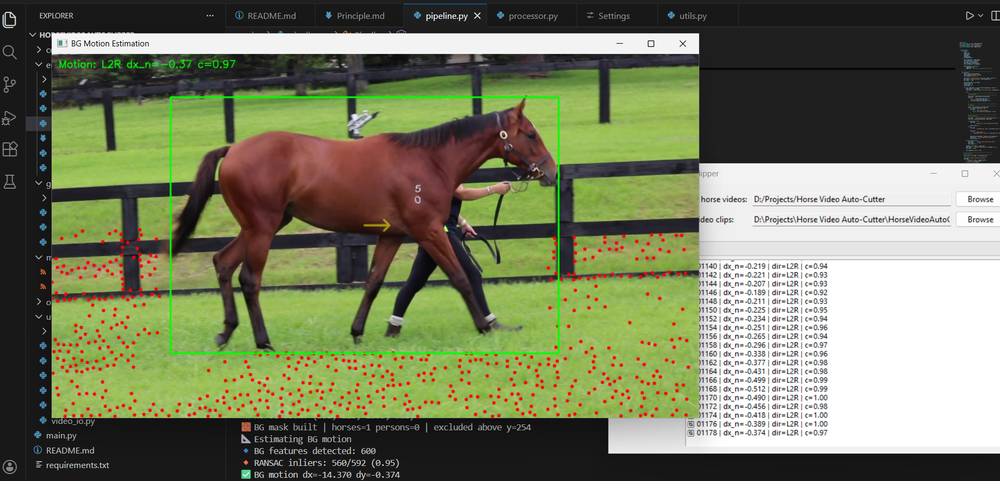

# Horse Video Auto Clipper

## Mission / Description

This application automatically identify the walking direction of a horse in yearling parade videos, detect the frame where the horse is most perpendicular to the camera, and extract a standardised clip (±2 seconds) around that moment.




## Running Source Code

```
pip install -r requirements.txt
python main.py
```


## Making Single Exe file

```
pyinstaller main.py --add-data "configs/bytetrack.yaml;configs" --add-data "models/yolov8m.pt;models"
```
